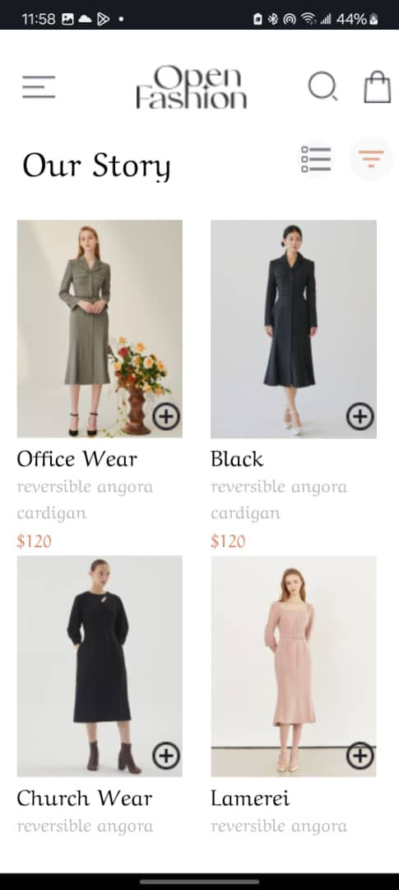
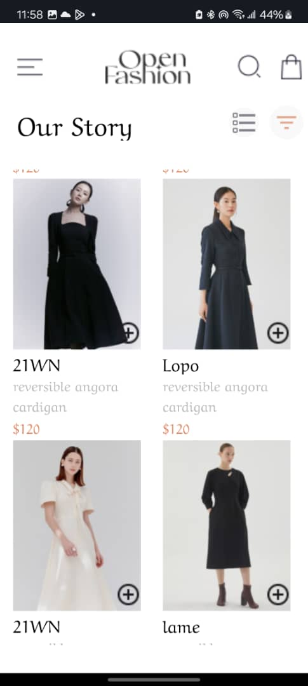
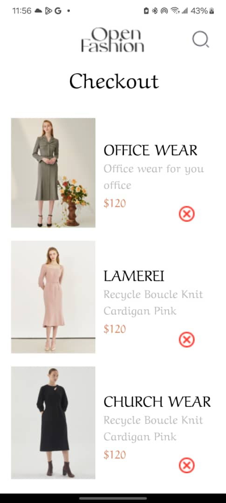

# App Overview

This app is a simple e-commerce platform showcasing a catalog of items that users can add to their cart. The design focuses on simplicity and ease of use, with a clean and intuitive interface.

## Design Choices

- **Expo SecureStore**: Used for secure, local storage of cart items. This choice ensures that user cart data is persisted across app launches in a secure manner.

- **Custom Fonts with Expo Google Fonts**: To enhance the UI's look and feel, custom fonts were integrated using Expo Google Fonts. This adds a unique touch to the app's design.
  
- **Navigation**: The use of React Navigation for navigating between the Home and Cart screens. It's a standard choice for handling routing in React Native apps, providing a smooth and native-like transition between screens.

## Implementation

### Data Storage

- **Cart Items**: Stored locally using Expo's SecureStore. This ensures that the items users add to their cart are saved securely and persistently, even when the app is closed. The cart items are stored as a JSON string, which is parsed and updated whenever items are added or removed.

### Screenshots

## Home Screen

## Cart

